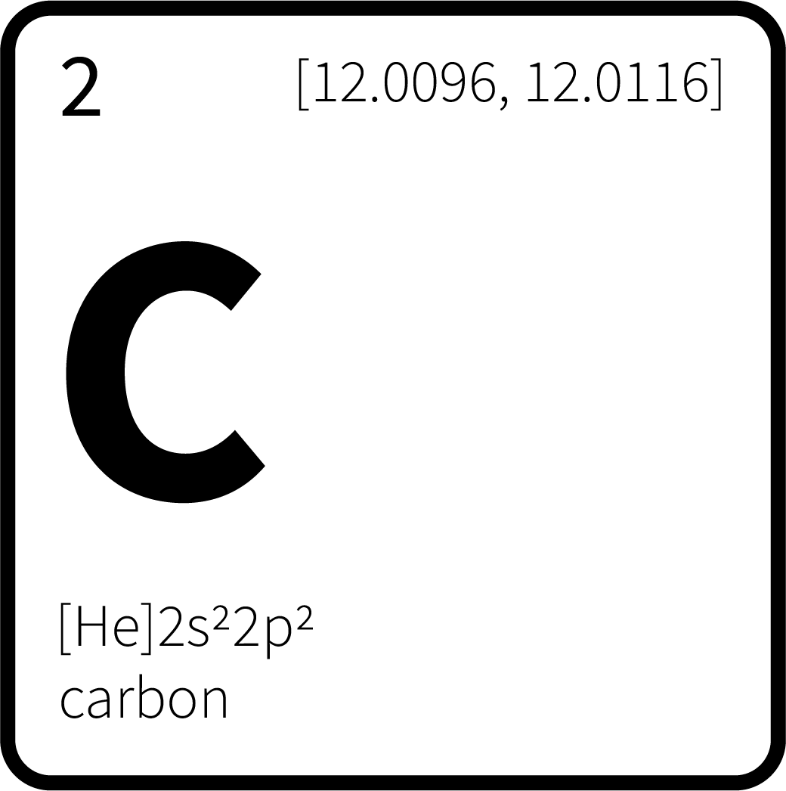

# react-native-carbon



React Native nebula engine

## Running the example
This uses symlinks.  In order to develop and run the sample @qlik/react-native-helium and @qlik/carbon-core have to be cloned in the same root directory as @qlik/react-native-carbon

Recommend way is to create a folder called "Carbon" and clone dependencies in there.
They should all be in the same root folder.
1. clone react-native-helium
2. clone me
3. clone carbon-core
4. cd into react-native-carbon
5. yarn dev-setup
6. in example/Galaxy create a galaxy.json with the following

```
{
  "tenantDomain": <your tenant>,
  "apiKey":<your api key>,
  "appId": <app id>,
  "modelId": <id of visualization>
}
```

## Interactions run on the UI Thread
To improve performance all interactions are run on the UI thread using react-native-helium.

## License

MIT
